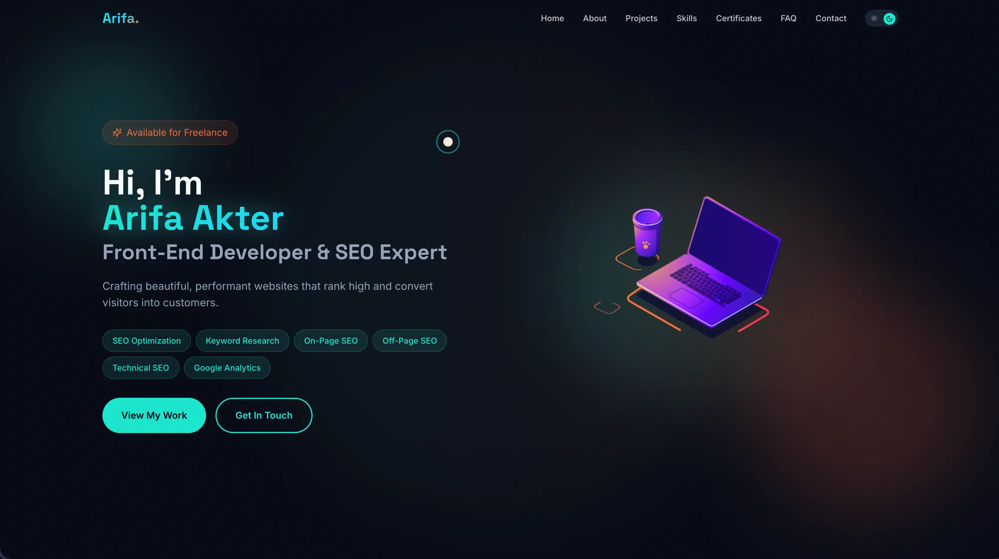

# Arifa Akter - Portfolio



Welcome to the personal portfolio repository of **Arifa Akter**. This project showcases my skills, experience, and projects as a Front-End Developer and SEO Expert. It's built with modern web technologies to ensure high performance, responsiveness, and a premium user experience.

## 👩‍💻 About Arifa

Hi, I'm **Arifa Akter** (also known as Arifa Afrin), a passionate **Front-End Developer** and **SEO Expert** based in **Dhaka, Bangladesh**.

I specialize in building stunning, user-friendly websites that not only look great but also rank high on search engines. With a keen eye for design and a deep understanding of technical SEO, I bridge the gap between aesthetics and performance.

**What I do:**
*   **Front-End Development:** Crafting responsive and interactive user interfaces using React and modern CSS frameworks.
*   **SEO Optimization:** Implementing technical and on-page SEO strategies to boost organic visibility.
*   **Web Performance:** Ensuring fast load times and smooth animations for the best user experience.

## 🚀 Tech Stack

This portfolio is engineered using a robust modern stack:

*   **Core:**
    *   [React](https://react.dev/) - A JavaScript library for building user interfaces.
    *   [TypeScript](https://www.typescriptlang.org/) - For type-safe code and better developer experience.
    *   [Vite](https://vitejs.dev/) - Next Generation Frontend Tooling for blazing fast builds.

*   **Styling & UI:**
    *   [Tailwind CSS](https://tailwindcss.com/) - A utility-first CSS framework for rapid UI development.
    *   [shadcn/ui](https://ui.shadcn.com/) - Beautifully designed components built with Radix UI and Tailwind CSS.
    *   [Framer Motion](https://www.framer.com/motion/) - A production-ready motion library for React.
    *   [Lucide React](https://lucide.dev/) - Beautiful & consistent icons.

*   **Functionality:**
    *   [EmailJS](https://www.emailjs.com/) - For sending emails directly from the contact form without a backend.
    *   [React Hook Form](https://react-hook-form.com/) - Performant, flexible and extensible forms with easy validation.
    *   [Zod](https://zod.dev/) - TypeScript-first schema declaration and validation library.

## 🛠️ Getting Started

Follow these steps to run the project locally:

1.  **Clone the repository:**
    ```bash
    git clone https://github.com/afrin-arifa/portfolio.git
    cd portfolio
    ```

2.  **Install dependencies:**
    ```bash
    npm install
    ```

3.  **Run the development server:**
    ```bash
    npm run dev
    ```
    Open `http://localhost:8080` (or the port shown in your terminal) to view it in the browser.

4.  **Build for production:**
    ```bash
    npm run build
    ```

## 📬 Contact Me

I am currently open to new opportunities and collaborations. Feel free to reach out!

*   **Email:** [afrinarifa965222@gmail.com](mailto:afrinarifa965222@gmail.com)
*   **Phone:** +880 1626-421068
*   **LinkedIn:** [Arifa Afrin](https://bd.linkedin.com/in/arifa-afrin-9481211a6)
*   **GitHub:** [afrin-arifa](https://github.com/afrin-arifa)

---
*Last updated: 2026*
